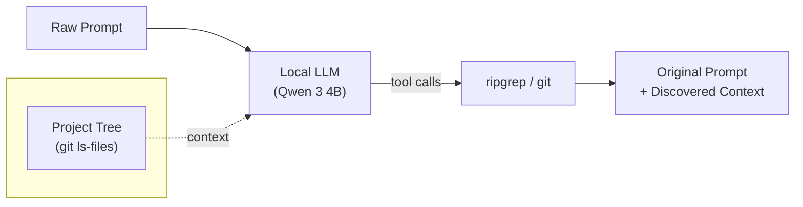

# promptscout

A CLI tool that enriches your coding agent prompts with codebase context using a local LLM. No API keys, no cloud. Runs on your machine.

**Designed as a Claude Code plugin.** It hooks into your prompt submission flow and adds codebase context before Claude sees it.

## Motivation

When you ask a coding agent like Claude Code, Cursor, or Copilot to work on your codebase, the agent spends time and tokens discovering which files matter. It greps, reads, explores, all on your dime.

promptscout does that discovery locally, for free. A small local LLM reads your prompt, searches your codebase with `ripgrep` and `git`, and appends the results to your original prompt. The paid agent gets a prompt that already contains the relevant file paths, code snippets, and commit history. It can skip straight to the actual work.

Your original prompt is never modified. promptscout only appends context.

## How It Works



1. You run `promptscout "check the auth module, there might be a token refresh bug"`
2. The local LLM sees your prompt along with the project file tree (`git ls-files`) and decides which search tools to call
3. The LLM outputs tool calls directly as JSON (e.g. `file_finder("auth")`, `section_finder("token")`, `git_history("refresh")`)
4. Each tool runs against your codebase using `ripgrep` and `git`
5. The output is your original prompt unchanged, followed by the discovered context
6. The result is copied to your clipboard, ready to paste into your coding agent

## Installation

### Prerequisites

- Node.js >= 20
- C++ compiler (Xcode Command Line Tools on macOS, `build-essential` on Linux)
- [ripgrep](https://github.com/BurntSushi/ripgrep) (`rg`) for fast codebase search
- `git` (for project tree generation and commit history search)
- ~3GB disk space for the model

### Install

```bash
npm install -g promptscout
```

Or from source:

```bash
git clone https://github.com/obsfx/promptscout.git
cd promptscout
pnpm install
pnpm build
pnpm link --global
```

### Setup

Run `promptscout setup` to create the data directory and download the `Qwen 3 4B` model (~2.5GB). The model is stored in `~/.promptscout/models/`.

## Claude Code Plugin


promptscout ships with a Claude Code plugin that enriches every prompt you send. Once installed, it runs in the background. No manual copy-pasting needed.

### Install the plugin

```bash
# Add the promptscout marketplace
claude /plugin marketplace add obsfx/promptscout

# Install the plugin
claude /plugin install promptscout
```

Or in Claude Code interactive mode:

```
/plugin marketplace add obsfx/promptscout
/plugin install promptscout
```

Once installed, every prompt you submit in Claude Code gets enriched with codebase context via the `UserPromptSubmit` hook. The plugin passes your prompt through `promptscout` with `--json-output --no-clipboard` and injects the result as additional context.

When context is found, the plugin shows a summary notification:

```
promptscout: enriched context (+5 files) (+3 sections) (+1 definitions)
```

If `promptscout` is not installed or fails for any reason, the plugin falls back silently and your original prompt goes through unchanged.

## Model

promptscout uses `Qwen 3 4B` (`Q4_K_M` quantization) running locally via [node-llama-cpp](https://github.com/withcatai/node-llama-cpp). The model uses GPU acceleration automatically when available (Metal on macOS, CUDA on Linux).

- Size: ~2.5GB (`GGUF Q4_K_M`)
- Context: 8192 tokens
- Latency: ~2s per prompt (Metal, Apple Silicon)
- Purpose: Decides which search tools to call based on your prompt and the project file tree. Does not rewrite your text.

## Tools

promptscout has 5 built-in search tools. The LLM picks which ones to call and with what keywords:

| Tool | What it does |
|---|---|
| `file_finder` | Finds files matching a keyword. Results scored by filename relevance. |
| `section_finder` | Finds code lines matching a keyword. Returns `file:line:code` entries. |
| `definition_finder` | Finds function, class, type, and struct definitions across languages. |
| `import_tracer` | Finds import/require/include statements referencing a module. |
| `git_history` | Finds recent commits that added or removed code matching a keyword. |

All search tools use `ripgrep`, which respects `.gitignore` and skips binary files automatically.

## Usage

```bash
# Basic usage (result copied to clipboard)
promptscout "check the camera module, we need to add timeout handling"

# Dry run (print to stdout, skip clipboard)
promptscout --dry-run --no-clipboard "refactor the search module"

# Specify project directory
promptscout --project-dir /path/to/project "check the auth flow"

# JSON output (for programmatic use)
promptscout --json-output "fix the pagination bug"
```

### Options

```
<prompt>                     Raw prompt to enrich
-o, --output <file>          Write result to file
--dry-run                    Show result without copying or saving
--json-output                Output JSON instead of plain text
--no-clipboard               Skip clipboard copy
--project-dir <dir>          Project root directory
```

## Commands

### `promptscout setup`

Initialize promptscout and download the default model. Creates the data directory at `~/.promptscout/` and downloads `Qwen 3 4B` (~2.5GB).

```bash
promptscout setup
```

### `promptscout history`

View prompt history with paginated table output.

```bash
# Show history for current directory (default: 10 per page)
promptscout history

# Show all history across directories
promptscout history -a

# Paginate results
promptscout history -p 2 -n 5

# Show full detail of a specific entry
promptscout history show 42

# Clear all history
promptscout history clear
```

## Examples

### Swift project (macOS audio capture tool)

```
$ promptscout "I want to add a new audio format export feature. check the current
audio processing pipeline and see how formats are handled"
```

```
I want to add a new audio format export feature. check the current audio processing
pipeline and see how formats are handled

Context from codebase:

<file_finder query="audio">
Sources/Core/AudioCaptureSession.swift
Sources/Core/AudioTapManager.swift
Sources/Info.plist
Sources/main.swift
Sources/CLI/ArgumentParser.swift
Sources/CLI/ExitCodes.swift
README.md
entitlements.plist
Sources/IO/RingBuffer.swift
Package.swift
</file_finder>

<definition_finder query="format">
Sources/main.swift:49:              let tapFormat = tapManager.tapFormat else {
Sources/main.swift:53:        let outputSampleRate = UInt32(tapFormat.mSampleRate)
Sources/main.swift:55:        let sourceChannels = Int(tapFormat.mChannelsPerFrame)
Sources/Core/InputDeviceQuery.swift:41:    var formatAddress = AudioObjectPropertyAddress(
Sources/Core/InputDeviceQuery.swift:46:    var format = AudioStreamBasicDescription()
Sources/Core/AudioTapManager.swift:23:        case .formatQueryFailed(let status):
Sources/Core/AudioTapManager.swift:34:    private(set) var tapFormat: AudioStreamBasicDescription?
Sources/Core/AudioTapManager.swift:103:    private func queryTapFormat(tapID: AudioObjectID) throws -> AudioStreamBasicDescription {
Sources/Core/AudioTapManager.swift:110:        var format = AudioStreamBasicDescription()
Sources/Core/AudioTapManager.swift:112:        let status = AudioObjectGetPropertyData(tapID, &address, 0, nil, &size, &format)
</definition_finder>

<import_tracer query="audio">
Sources/IO/RingBuffer.swift:39:    /// Write bytes into the ring buffer. Called from the real-time audio thread.
README.md:13:Download the latest build from the releases page.
README.md:77:Record from the default microphone instead of system audio.
README.md:149:The included entitlements.plist declares com.apple.security.device.audio-input.
</import_tracer>
```

### TypeScript project (task management CLI)

```
$ promptscout "I want to add task filtering by status and tags. check how tasks
are stored and queried"
```

```
I want to add task filtering by status and tags. check how tasks are stored and queried

Context from codebase:

<file_finder query="task">
src/services/task.ts
src/commands/task.ts
src/commands/subtask.ts
tests/commands/subtask.test.ts
tests/commands/task.test.ts
package.json
src/services/epic.ts
README.md
CLAUDE.md
src/services/history.ts
</file_finder>

<section_finder query="status">
src/services/task.ts:9:  TaskStatus,
src/services/task.ts:73:  status?: TaskStatus;
src/services/task.ts:81:  if (options?.status) {
src/services/task.ts:82:    conditions.push(eq(tasks.status, options.status));
src/services/list.ts:56:  if (options?.statuses && options.statuses.length > 0) {
src/services/list.ts:57:    const placeholders = options.statuses.map(() => "?").join(", ");
src/services/list.ts:58:    conditions.push(`status IN (${placeholders})`);
</section_finder>

<section_finder query="tag">
src/services/task.ts:56:    tags: input.tags ?? null,
src/services/task.ts:140:  if (input.tags !== undefined) updates.tags = input.tags;
src/commands/task.ts:29:  .option("--tags <tags>", "Comma-separated tags")
src/commands/task.ts:91:  .option("--tags <tags>", "New tags (comma-separated)")
</section_finder>

<definition_finder query="task">
src/services/task.ts:16:export function createTask(input: CreateTaskInput): Task {
src/services/task.ts:66:export function getTask(id: string): Task | undefined {
src/services/task.ts:72:export function listTasks(options?: {
src/services/task.ts:116:export function updateTask(id: string, input: UpdateTaskInput): Task {
</definition_finder>

<import_tracer query="task">
src/services/task.ts:3:import { tasks, projects, epics } from "../db/schema";
src/services/comment.ts:3:import { comments, tasks } from "../db/schema";
src/services/dependency.ts:3:import { dependencies, tasks } from "../db/schema";
src/commands/task.ts:8:} from "../services/task";
</import_tracer>
```

### React/TypeScript project (terminal ebook downloader)

```
$ promptscout "I need to refactor the search module. check how search and pagination
currently work and find the related components"
```

```
I need to refactor the search module. check how search and pagination currently work
and find the related components

Context from codebase:

<file_finder query="search">
src/tui/layouts/search/search-input/SearchInput.tsx
src/tui/layouts/search/search-input/SearchWarning.tsx
src/tui/layouts/search/index.tsx
src/tui/layouts/search/search-input/index.tsx
src/options.ts
src/labels.ts
src/constants.ts
src/utils.ts
src/settings.ts
CLAUDE.md
</file_finder>

<definition_finder query="search">
src/api/data/document.ts:3:export async function getDocument(searchURL: string): Promise<Document> {
src/constants.ts:1:export const SEARCH_MIN_CHAR = 3;
src/settings.ts:11:export const SEARCH_PAGE_SIZE = 25;
src/tui/store/events.ts:31:    const searchURL = get().mirrorAdapter?.getSearchURL(query, pageNumber, SEARCH_PAGE_SIZE);
src/tui/store/events.ts:68:    const entries = await store.search(store.searchValue, store.currentPage);
src/tui/layouts/search/index.tsx:8:const Search: React.FC = () => {
</definition_finder>
```

### No-context detection

When the prompt has no technical keywords (pure acknowledgment), promptscout returns it unchanged:

```
$ promptscout "thanks, that works perfectly"
```

```
thanks, that works perfectly
```

## License

MIT
