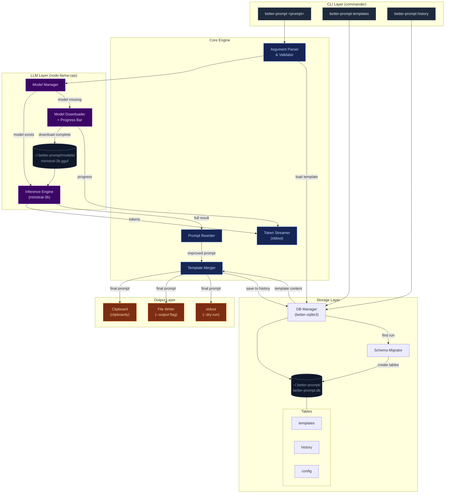

# better-prompt

CLI tool that improves coding agent prompts using a local LLM. It analyzes raw prompts, restructures them into clear direct instructions, and combines them with user-defined templates.

## Problem

Coding agents (Claude, Copilot, etc.) need specific, repeated instructions to produce consistent output. Even with `CLAUDE.md` / `AGENT.md` files, users re-type the same structural guidance every time. `better-prompt` eliminates this by combining a reusable template with LLM-powered prompt rewriting — fully offline.

## Core Concepts

- **Template**: A reusable prompt skeleton (e.g. "always use TypeScript strict mode, prefer composition over inheritance, write tests"). Users can have multiple named templates.
- **History**: Every generated prompt is stored with metadata (directory, timestamp, template used, original input, final output).

## Tech Stack

- **Runtime**: Node.js (ESM)
- **Language**: TypeScript
- **LLM**: `node-llama-cpp` with `ministral-3b` (GGUF format)
- **Database**: SQLite via `better-sqlite3` (sync API, no ORM)
- **CLI framework**: `commander`
- **Storage root**: `~/.better-prompt/`

## Directory Structure

```
~/.better-prompt/
├── models/          # Downloaded GGUF model files
├── better-prompt.db # SQLite database (templates, history, config)
```

## Database Schema

```sql
CREATE TABLE templates (
  id INTEGER PRIMARY KEY AUTOINCREMENT,
  name TEXT UNIQUE NOT NULL,
  content TEXT NOT NULL,
  created_at TEXT DEFAULT (datetime('now')),
  updated_at TEXT DEFAULT (datetime('now'))
);

CREATE TABLE history (
  id INTEGER PRIMARY KEY AUTOINCREMENT,
  directory TEXT NOT NULL,        -- cwd where command was invoked
  template_name TEXT,             -- nullable, template used (if any)
  raw_input TEXT NOT NULL,        -- original user prompt
  improved_output TEXT NOT NULL,  -- LLM-rewritten prompt
  final_output TEXT NOT NULL,     -- template + improved prompt combined
  created_at TEXT DEFAULT (datetime('now'))
);

CREATE TABLE config (
  key TEXT PRIMARY KEY,
  value TEXT NOT NULL
);
```

## CLI Commands

### `better-prompt <prompt>`

Main command. Takes raw prompt string, rewrites it via LLM, merges with active/specified template, copies result to clipboard.

**Flags:**

- `-t, --template <name>` — use a specific template (default: `default`)
- `-o, --output <file>` — write result to file instead of clipboard
- `--no-template` — skip template merging, only rewrite
- `--dry-run` — show result without copying/saving

**Flow:**

1. Ensure model is downloaded (if not, download with progress bar)
2. Send user prompt to local LLM for tool-call evaluation
3. Retrieve template by name
5. Combine: template content + LLM-improved prompt
6. Copy to clipboard, save to history, print result

### `better-prompt templates`

List all templates (name, preview of first 80 chars, created date).

### `better-prompt templates add <name>`

Create a new template. Opens `$EDITOR` (or falls back to inline stdin input) for content.

### `better-prompt templates edit <name>`

Edit existing template in `$EDITOR`.

### `better-prompt templates remove <name>`

Delete a template. Confirm before deletion.

### `better-prompt templates show <name>`

Print full template content.

### `better-prompt history`

List recent history entries for current directory. Shows truncated input/output, timestamp.

**Flags:**

- `-a, --all` — show history across all directories
- `-n, --limit <number>` — number of entries (default: 20)

### `better-prompt history show <id>`

Print full detail of a history entry.

### `better-prompt history clear`

Clear history. Confirm before deletion.

## Model Management

- Model: `ministral-3b` in GGUF Q4_K_M quantization
- Download source: Hugging Face (hardcode URL)
- Download location: `~/.better-prompt/models/`
- On first run of main command, check if model file exists
- If missing, show: file name, total size, download progress bar with percentage/speed/ETA
- Use `node-llama-cpp`'s built-in model download utilities if available, otherwise stream download with progress via `cli-progress` or similar

## Error Handling

- Model not found + no internet → clear error message, exit 1
- Template not found → list available templates, exit 1
- Empty prompt input → show usage hint, exit 1
- LLM inference failure → show error, save nothing to history

## Notes for Implementation

- Initialize DB + tables on first run (run migrations check at startup)
- Clipboard: use `clipboardy` package (cross-platform)
- All commands should work without the model downloaded except the main rewrite command
- Keep LLM context window usage minimal — tool-calling prompt + user input only, no chat history
- Stream LLM output to stdout token-by-token for UX feedback during generation


