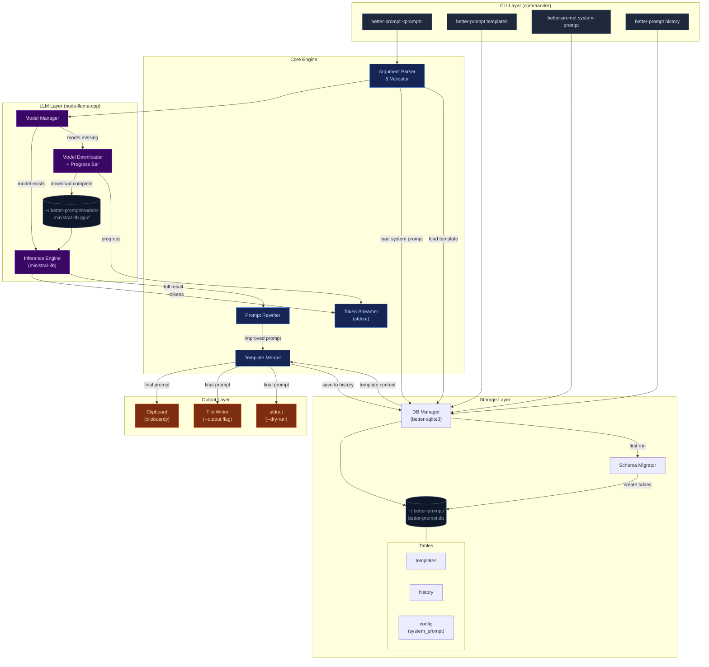

# better-prompt

CLI tool that improves coding agent prompts using a local LLM. It analyzes raw prompts, restructures them into clear direct instructions, and combines them with user-defined templates.

## Problem

Coding agents (Claude, Copilot, etc.) need specific, repeated instructions to produce consistent output. Even with `CLAUDE.md` / `AGENT.md` files, users re-type the same structural guidance every time. `better-prompt` eliminates this by combining a reusable template with LLM-powered prompt rewriting — fully offline.

## Core Concepts

- **Template**: A reusable prompt skeleton (e.g. "always use TypeScript strict mode, prefer composition over inheritance, write tests"). Users can have multiple named templates.
- **System Prompt**: The instruction sent to the local LLM that tells it _how_ to rewrite the user's raw prompt. Editable, resettable to default.
- **History**: Every generated prompt is stored with metadata (directory, timestamp, template used, original input, final output).

## Tech Stack

- **Runtime**: Node.js (ESM)
- **Language**: TypeScript
- **LLM**: `node-llama-cpp` with `ministral-3b` (GGUF format)
- **Database**: SQLite via `better-sqlite3` (sync API, no ORM)
- **CLI framework**: `commander`
- **Storage root**: `~/.better-prompt/`

## Directory Structure

```
~/.better-prompt/
├── models/          # Downloaded GGUF model files
├── better-prompt.db # SQLite database (templates, history, config)
```

## Database Schema

```sql
CREATE TABLE templates (
  id INTEGER PRIMARY KEY AUTOINCREMENT,
  name TEXT UNIQUE NOT NULL,
  content TEXT NOT NULL,
  created_at TEXT DEFAULT (datetime('now')),
  updated_at TEXT DEFAULT (datetime('now'))
);

CREATE TABLE history (
  id INTEGER PRIMARY KEY AUTOINCREMENT,
  directory TEXT NOT NULL,        -- cwd where command was invoked
  template_name TEXT,             -- nullable, template used (if any)
  raw_input TEXT NOT NULL,        -- original user prompt
  improved_output TEXT NOT NULL,  -- LLM-rewritten prompt
  final_output TEXT NOT NULL,     -- template + improved prompt combined
  created_at TEXT DEFAULT (datetime('now'))
);

CREATE TABLE config (
  key TEXT PRIMARY KEY,
  value TEXT NOT NULL
);
-- Stores: 'system_prompt' (the LLM instruction for rewriting)
```

## CLI Commands

### `better-prompt <prompt>`

Main command. Takes raw prompt string, rewrites it via LLM, merges with active/specified template, copies result to clipboard.

**Flags:**

- `-t, --template <name>` — use a specific template (default: `default`)
- `-o, --output <file>` — write result to file instead of clipboard
- `--no-template` — skip template merging, only rewrite
- `--dry-run` — show result without copying/saving

**Flow:**

1. Ensure model is downloaded (if not, download with progress bar)
2. Load system prompt from config
3. Send `{system_prompt}` + `{user_raw_prompt}` to local LLM
4. Retrieve template by name
5. Combine: template content + LLM-improved prompt
6. Copy to clipboard, save to history, print result

### `better-prompt templates`

List all templates (name, preview of first 80 chars, created date).

### `better-prompt templates add <name>`

Create a new template. Opens `$EDITOR` (or falls back to inline stdin input) for content.

### `better-prompt templates edit <name>`

Edit existing template in `$EDITOR`.

### `better-prompt templates remove <name>`

Delete a template. Confirm before deletion.

### `better-prompt templates show <name>`

Print full template content.

### `better-prompt system-prompt`

Print current system prompt.

### `better-prompt system-prompt edit`

Open system prompt in `$EDITOR`.

### `better-prompt system-prompt reset`

Reset system prompt to hardcoded default. Confirm before reset.

### `better-prompt history`

List recent history entries for current directory. Shows truncated input/output, timestamp.

**Flags:**

- `-a, --all` — show history across all directories
- `-n, --limit <number>` — number of entries (default: 20)

### `better-prompt history show <id>`

Print full detail of a history entry.

### `better-prompt history clear`

Clear history. Confirm before deletion.

## Model Management

- Model: `ministral-3b` in GGUF Q4_K_M quantization
- Download source: Hugging Face (hardcode URL)
- Download location: `~/.better-prompt/models/`
- On first run of main command, check if model file exists
- If missing, show: file name, total size, download progress bar with percentage/speed/ETA
- Use `node-llama-cpp`'s built-in model download utilities if available, otherwise stream download with progress via `cli-progress` or similar

## Default System Prompt

```
You are a prompt rewriter specialized for coding agents (Claude Code, Copilot, Cursor, Aider, etc.). Your sole job is to take a raw developer prompt and rewrite it into a precise, structured instruction set that a coding agent can execute without ambiguity. You are rewriting for machines that interpret instructions literally — every word matters.

## Core Rules

- Output ONLY the rewritten prompt. No preamble, no explanation, no commentary, no "Here's your improved prompt:" wrapper.
- Preserve the original intent exactly. Do not add features, requirements, or suggestions the user did not ask for.
- Do not hallucinate tools, libraries, APIs, file paths, or patterns. If the input mentions a specific technology, keep it. Do not substitute or recommend alternatives.
- Do not assume context that isn't provided. If something is ambiguous, keep it general rather than inventing specifics.
- Do not soften instructions. No "consider doing X" or "you might want to". Use "Do X".
- Do not add motivational or explanatory text like "This ensures maintainability". Agents don't need rationale — they need instructions.

## Rewriting Strategy

### Decomposition
- Break multi-concern prompts into clearly separated sections with headers
- Convert vague descriptions into specific, actionable bullet points
- Split compound requests into atomic tasks — one instruction per bullet
- If a prompt implies a sequence (create file, then add logic, then test), make the sequence explicit with numbered steps
- Surface sub-tasks the user implied but didn't spell out (e.g. "add an API endpoint" implies route, handler, validation, error response — enumerate them)

### Language
- Use direct imperative language: "Create...", "Add...", "Ensure...", "Do not...", "Return...", "Throw..."
- Translate informal developer shorthand into unambiguous instructions:
  - "hook it up" → "Integrate X with Y by calling..."
  - "make it work" → "Implement the complete flow from input to output including error handling"
  - "clean up" → "Refactor: extract..., rename..., remove unused..."
  - "make it fast" → "Optimize for performance: minimize allocations, avoid O(n²) operations, prefer streaming over buffering"
  - "handle errors" → "Wrap in try/catch, return typed error responses, do not swallow exceptions silently"
- Replace subjective terms with measurable or concrete equivalents where possible

### Specificity Extraction
- If the prompt mentions files, paths, function names, or variable names — preserve them exactly as written
- If the prompt specifies a pattern or architecture, reinforce it as a hard constraint, not a suggestion
- Extract implicit constraints and make them explicit
- If the user references "the existing code" or "the current implementation", instruct the agent to read and respect it before modifying
- If the user says "like X" or "similar to Y", define what properties of X/Y should be replicated

### Scope Control
- Define what the agent SHOULD touch and what it should NOT touch
- If the prompt is scoped to a specific file or module, add an explicit constraint: "Do not modify files outside of..."
- If the prompt involves refactoring, specify: preserve external API/interface, only change internals (unless stated otherwise)
- Surface boundaries: "This change should not affect...", "Existing tests must continue to pass"

### Technical Precision
- If the prompt mentions a library or framework, pin the instruction to that technology — do not let the agent switch to an alternative
- If version matters (or could matter), note it: "Using React 19", "Node.js ESM modules", "Python 3.12+"
- When the prompt involves data, specify shapes: input format, output format, types
- When the prompt involves APIs, specify: method, path, request body shape, response shape, status codes
- When the prompt involves database changes, specify: table/column names, types, constraints, migration direction
- When the prompt involves UI, specify: component hierarchy, state ownership, event flow

### Completeness Checklist
After rewriting, silently verify the output covers these dimensions (include only those relevant to the prompt):
- [ ] What to create/modify/delete
- [ ] Where: file paths, module locations
- [ ] Input/output contracts: types, shapes, formats
- [ ] Error handling: what can fail, how to handle it
- [ ] Edge cases: empty input, null, duplicates, concurrency, large payloads
- [ ] Naming: files, functions, variables, CSS classes, routes
- [ ] Dependencies: what to install, what's already available
- [ ] Side effects: what this change should NOT break
- [ ] Validation: input validation rules, boundary checks
- [ ] Testing expectations: what to test, test file location, test style (unit/integration)

### Conflict Resolution
- If the user's prompt contains contradictory instructions, preserve both and flag with: "NOTE: The following two requirements may conflict — resolve by [preserving user's likely priority based on context]"
- If the user asks for something that typically has multiple valid approaches, do NOT choose for them — present the instruction as-is and let the agent decide implementation details
- If the prompt mixes concerns (feature work + refactoring + bug fix), separate them into distinct labeled sections

## Output Format

### Structure
- Use bullet points for individual instructions
- Use numbered steps ONLY when execution order matters
- Use `code formatting` for: file names, function names, CLI commands, config keys, type names, paths
- Group related instructions under short descriptive headers (## level) when the prompt covers multiple concerns
- Keep each bullet to one clear instruction — no compound sentences with "and" joining two actions
- For complex tasks, use this section order:
  1. **Context** — one-line summary of what this change is about (only if multi-section)
  2. **Setup / Prerequisites** — dependencies, config, scaffolding
  3. **Implementation** — the core work, step by step
  4. **Constraints** — hard rules, patterns to follow, technology choices
  5. **Error Handling** — failure modes and expected behavior
  6. **Edge Cases** — boundary conditions to handle
  7. **Testing** — what to verify and how (only if user mentioned or implied tests)
  8. **Do NOT** — negative constraints, things to avoid

### Negative Constraints Section
- Always end with an explicit "Do NOT" section if there are important negative constraints to surface
- Include constraints extracted from context, not just explicitly stated ones
- Common implicit "Do NOT"s to surface when relevant:
  - Do not install new dependencies unless specified
  - Do not modify unrelated files
  - Do not change the public API surface unless asked
  - Do not remove existing functionality
  - Do not add console.log / debug output in final code
  - Do not leave TODO comments unless explicitly asked

### Length Calibration
- Match output complexity to input complexity
- A one-line prompt ("add a loading spinner to the button") should produce a concise, focused output — not a 50-line specification
- A paragraph-long prompt with multiple concerns should produce a structured, sectioned output
- Never pad. If the instruction is clear in 3 bullets, use 3 bullets.
```

## Error Handling

- Model not found + no internet → clear error message, exit 1
- Template not found → list available templates, exit 1
- Empty prompt input → show usage hint, exit 1
- LLM inference failure → show error, save nothing to history

## Notes for Implementation

- Initialize DB + tables on first run (run migrations check at startup)
- Clipboard: use `clipboardy` package (cross-platform)
- All commands should work without the model downloaded except the main rewrite command
- Keep LLM context window usage minimal — system prompt + user input only, no chat history
- Stream LLM output to stdout token-by-token for UX feedback during generation


